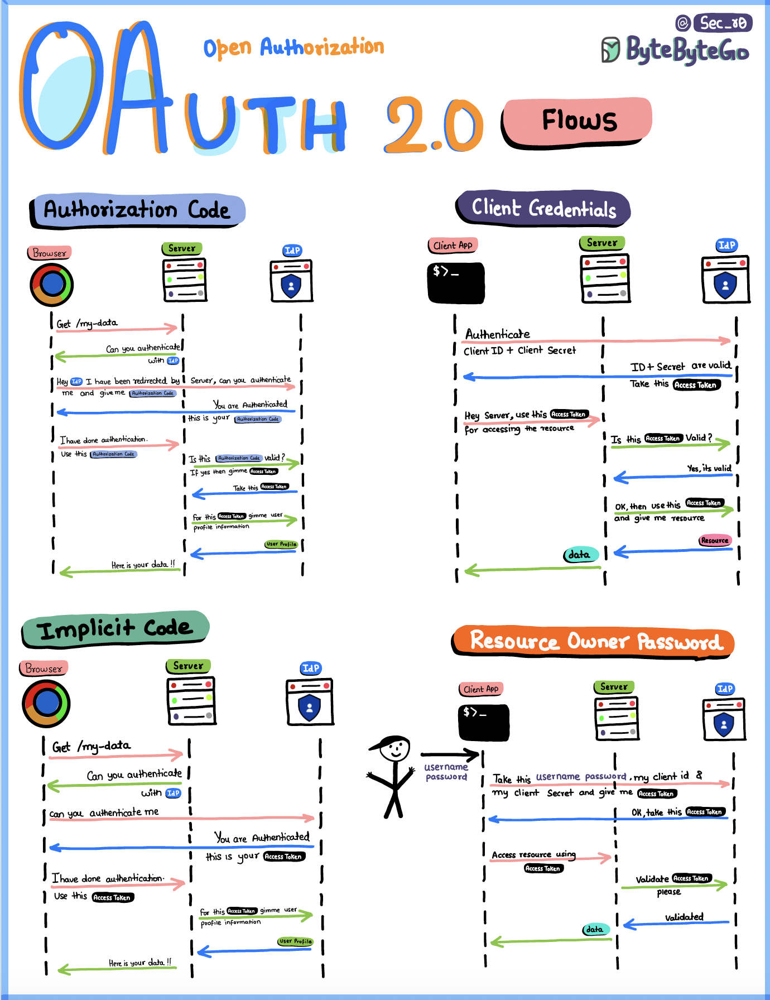

# WSO2 IS + .NET 9 SSO

A production-ready **Single Sign-On (SSO)** solution integrating **WSO2 Identity Server 7.1** with **.NET 9**.


## 🎯 Features

- ✅ **WSO2 OAuth2 Integration** - OAuth2 Resource Owner Password Credentials (ROPC) flow
- ✅ **Custom Login Page** - No WSO2 hosted pages required
- ✅ **JWT Authentication** - Secure Bearer token authentication
- ✅ **Role-Based Access Control** - 3 user roles (admin, user, test)
- ✅ **Web Dashboard** - Responsive HTML/CSS/JavaScript UI
- ✅ **Product Management** - Full CRUD API with role-based restrictions
- ✅ **Swagger API Docs** - Interactive endpoint testing
- ✅ **Clean Architecture** - Layered architecture (Domain → Application → Infrastructure → API)
- ✅ **SQLite Database** - Included with 11 sample products
- ✅ **Global Error Handling** - Centralized middleware exception handling

## 🏗️ Architecture

```
┌──────────────────────────────────────────────┐
│        Web UI (HTML/CSS/JavaScript)          │
│     Custom Login + Products Dashboard        │
├──────────────────────────────────────────────┤
│          ASP.NET Core 9 REST API             │
│   Auth | Products | Users | Swagger Docs     │
├──────────────────────────────────────────────┤
│    Application Layer (Services, DTOs)        │
├──────────────────────────────────────────────┤
│  Infrastructure (EF Core, Repos, WSO2)       │
├──────────────────────────────────────────────┤
│     Domain (Entities, Enums, Rules)          │
├──────────────────────────────────────────────┤
│    WSO2 Identity Server 7.1 (OAuth2)         │
└──────────────────────────────────────────────┘
```
## Authentication Flow




## 🚀 Quick Start

### Prerequisites
- .NET 9 SDK
- Git
- WSO2 IS 7.1

### Setup (< 10 minutes)

```bash
# 1. Clone
git clone https://github.com/ThomasHeinThura/WSO2_IS_Dotnet_SSO.git
cd WSO2_IS_Dotnet_SSO

# 2. Run setup
chmod +x setup.sh
./setup.sh

# 3. Configure
nano src/DistributionManagement.API/.env

# 4. Build & Run
dotnet build
dotnet run --project src/DistributionManagement.API
```

**Access:**
- 🌐 Web UI: http://localhost:5299
- 📚 Swagger: http://localhost:5299/swagger

📖 See [QUICKSTART.md](QUICKSTART.md) for detailed setup instructions.

## 👥 User Roles

| Role | Permissions |
|------|-------------|
| **yks_admin** | View users, Full product CRUD, Delete products |
| **yks_user** | Create & edit products, View all products |
| **yks_test** | View products only |

## 🔐 Authentication Flow

```
User Input (Username/Password)
         ↓
    Web UI Form
         ↓
POST /api/auth/login
         ↓
Backend → WSO2 OAuth2 Token Endpoint
         ↓
Backend → WSO2 /userinfo Endpoint
         ↓
JWT Token + User Info → Frontend
         ↓
localStorage (Browser)
         ↓
API Calls with: Authorization: Bearer TOKEN
```

## 📝 API Endpoints

### Authentication
```
POST   /api/auth/login       Login with credentials
GET    /api/auth/me          Current user information
POST   /api/auth/validate    Validate JWT token
```

### Products
```
GET    /api/product          Get all products (all roles)
GET    /api/product/{id}     Get product by ID (all roles)
POST   /api/product          Create product (admin, user)
PUT    /api/product/{id}     Update product (admin, user)
DELETE /api/product/{id}     Delete product (admin only)
```

### Users
```
GET    /api/user             Get all users (admin only)
```

## 💾 Database

### Development
- **Engine:** SQLite
- **File:** `distribution.db`
- **Auto-seeded:** 11 sample products

### Production
- **Engine:** PostgreSQL
- **Configuration:** Edit `.env` with PostgreSQL connection string

## 🛠️ Technology Stack

| Component | Technology |
|-----------|-----------|
| Backend Framework | ASP.NET Core 9 |
| Language | C# |
| Web Server | Kestrel |
| Database ORM | Entity Framework Core 9 |
| Identity Provider | WSO2 IS 7.1 |
| Authentication | OAuth2 + JWT |
| API Documentation | Swagger / OpenAPI |
| Frontend | HTML5, CSS3, JavaScript |

## 📁 Project Structure

```
src/
├── DistributionManagement.Domain/
│   ├── Entities/
│   │   ├── Product.cs (38 lines)
│   │   └── User.cs (35 lines)
│   └── Enums/
│       └── UserRole.cs (10 lines)
│
├── DistributionManagement.Application/
│   ├── DTOs/ (45 lines)
│   ├── Interfaces/ (30 lines)
│   └── Services/
│       └── ProductService.cs (70 lines)
│
├── DistributionManagement.Infrastructure/
│   ├── Data/
│   │   ├── ApplicationDbContext.cs (30 lines)
│   │   └── DbInitializer.cs (42 lines)
│   ├── Repositories/
│   │   └── ProductRepository.cs (52 lines)
│   └── ExternalServices/
│       └── WSO2AuthenticationService.cs (130 lines)
│
└── DistributionManagement.API/
    ├── Controllers/ (212 lines)
    ├── Middleware/ (45 lines)
    ├── Configuration/ (88 lines)
    ├── wwwroot/
    │   ├── index.html (150 lines) ← Login page
    │   ├── styles.css (400 lines)
    │   └── app.js (300 lines)
    ├── Program.cs (75 lines)
    └── appsettings.json
```

**Total:** ~1,900 lines of code + UI

## 🧪 Testing

### Via Swagger UI
1. Open http://localhost:5299/swagger
2. Click "POST /api/auth/login"
3. Enter username & password
4. Copy access token
5. Click "Authorize" button
6. Paste token
7. Test other endpoints

### Via cURL

```bash
# Login
TOKEN=$(curl -s -X POST http://localhost:5299/api/auth/login \
  -H "Content-Type: application/json" \
  -d '{"username":"yks","password":"PASSWORD"}' | jq -r '.accessToken')

# Get products
curl -X GET http://localhost:5299/api/product \
  -H "Authorization: Bearer $TOKEN"

# Create product
curl -X POST http://localhost:5299/api/product \
  -H "Authorization: Bearer $TOKEN" \
  -H "Content-Type: application/json" \
  -d '{"name":"Test","price":99.99,"stockQuantity":10,"isActive":true}'
```

## 🔧 Configuration

All settings in `.env` file:

```bash
# WSO2
WSO2__TokenEndpoint=https://iam.bimats.com/oauth2/token
WSO2__UserInfoEndpoint=https://iam.bimats.com/oauth2/userinfo
WSO2__ClientId=YOUR_CLIENT_ID
WSO2__ClientSecret=YOUR_CLIENT_SECRET

# JWT
JWT__Issuer=https://iam.bimats.com/oauth2/token
JWT__Audience=YOUR_CLIENT_ID

# Database
Database__Provider=SQLite
ConnectionStrings__DefaultConnection=Data Source=distribution.db

# Environment
ASPNETCORE_ENVIRONMENT=Development
```

## 🐛 Troubleshooting

| Issue | Solution |
|-------|----------|
| WSO2 connection failed | Verify credentials in `.env`, check WSO2 is running |
| Port 5299 in use | Kill process: `lsof -ti:5299 \| xargs kill -9` |
| Authentication fails | Verify user exists in WSO2 with correct role |
| 403 Unauthorized | Check token validity and user roles |
| Database error | Delete `distribution.db` and restart |

See [QUICKSTART.md](QUICKSTART.md) for detailed troubleshooting.

## 📚 Learning Resources

- [WSO2 IS 7.1 Docs](https://is.docs.wso2.com/en/7.1.0/)
- [.NET 9 Documentation](https://learn.microsoft.com/en-us/dotnet/)
- [OAuth2 RFC 6749](https://oauth.net/2/)
- [JWT Introduction](https://jwt.io/introduction)
- [Clean Architecture](https://blog.cleancoder.com/uncle-bob/2012/08/13/the-clean-architecture.html)

## 📄 License

MIT License - See LICENSE file for details

## 🤝 Contributing

1. Fork the repository
2. Create feature branch (`git checkout -b feature/amazing-feature`)
3. Commit changes (`git commit -m 'Add amazing feature'`)
4. Push to branch (`git push origin feature/amazing-feature`)
5. Open Pull Request

## 👨‍💻 Author

**Thomas Hein Thura**  
WSO2 IS + .NET 9 SSO Integration

---

## 📌 Quick Links

- 🔗 [GitHub Repository](https://github.com/ThomasHeinThura/WSO2_IS_Dotnet_SSO)
- 📖 [Quick Start Guide](QUICKSTART.md)
- 🚀 [Live Demo](http://localhost:5299) (after running locally)

---

**Ready to implement SSO?** Clone and run `./setup.sh` to get started! 🚀
